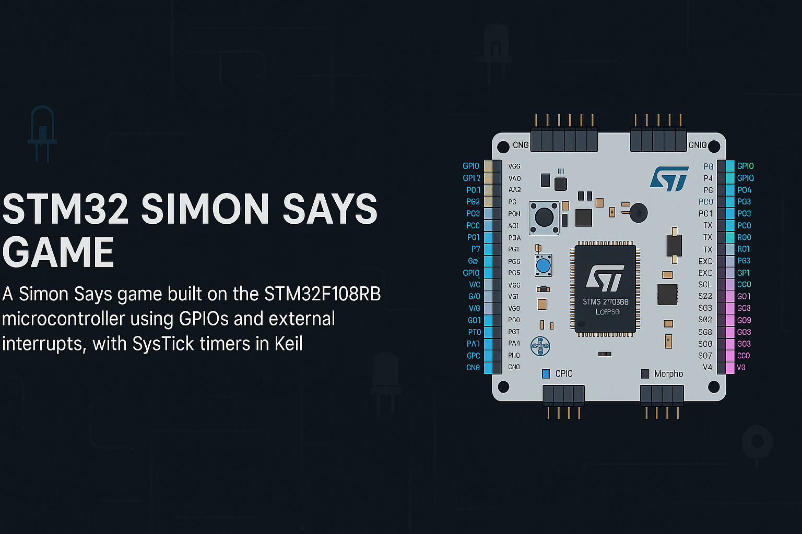

<h1 align="center">Simon Says - STM32 Embedded Game</h1>

<p align="center">
  
</p>

<p align="center">
  <i>A memory-challenging embedded game built on STM32 using C, GPIOs, and SysTick timing.</i>
</p>

---

## 🎮 Game Overview

- 🟢 Starts with a **Knight Rider-style LED animation**
- 🔁 Repeats an LED pattern that the user must match
- 🎯 Pattern length increases after each correct round
- ❌ Error animation plays on failure; ✅ Win animation on completion

---

## 🔌 Hardware Overview

- **Board**: STM32F103RB  
- **Inputs**: 4 Buttons (External Interrupts)  
- **Outputs**: 4 LEDs  
- **Programming Language**: C  
- **IDE**: Keil µVision  
- **Timing**: SysTick timer for delays and control

---

## 📍 GPIO Pin Configuration

| Component   | Pin   | Function                 |
|-------------|--------|--------------------------|
| LED 1       | `PA0`  | Output - Sequence LED 1  |
| LED 2       | `PA1`  | Output - Sequence LED 2  |
| LED 3       | `PA2`  | Output - Sequence LED 3  |
| LED 4       | `PA3`  | Output - Sequence LED 4  |
| Button 1    | `PB0`  | Input - EXTI for LED 1   |
| Button 2    | `PB1`  | Input - EXTI for LED 2   |
| Button 3    | `PB10` | Input - EXTI for LED 3   |
| Button 4    | `PB11` | Input - EXTI for LED 4   |

---

## ⚙️ Code Snippets

<details>
<summary><b>🔁 Blink LED Function (SysTick)</b></summary>

```c
void blink_led(GPIO_TypeDef *port, uint16_t pin) {
    port->ODR |= pin;
    delay_ms(500);
    port->ODR &= ~pin;
}
